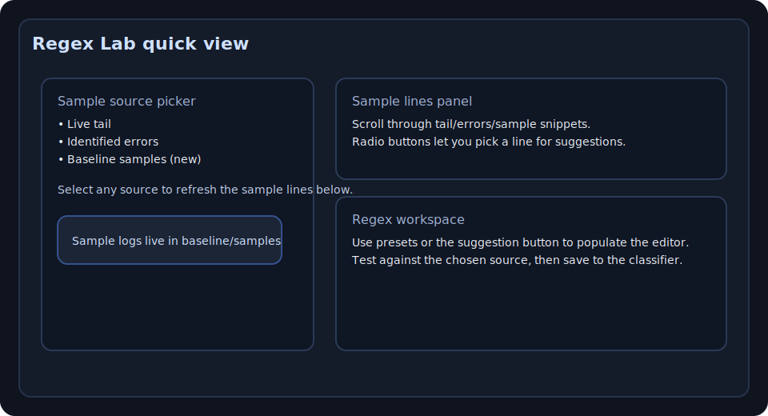
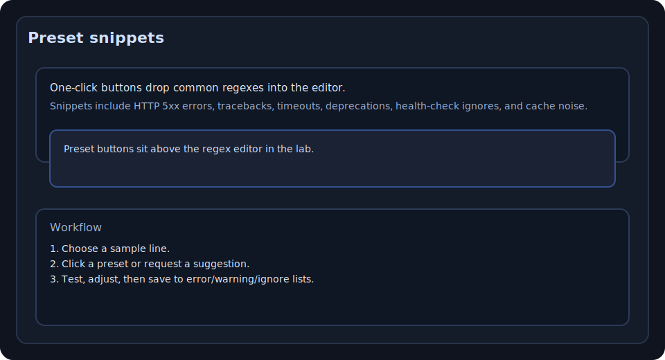

[](https://github.com/giovi321/log-triage)
[](https://www.python.org/)
[](https://github.com/giovi321/log-triage/blob/main/LICENSE)


`log-triage` is a Python tool that sits between your log collector (for example Fluent Bit) and an LLM. The current toolkit version is **v0.0.1**.

It works per *module* defined in a YAML config file. Each module describes:

- which log file or directory to read
- whether to run in batch mode or follow mode
- which pipeline (rules) to apply
- when to prepare LLM payloads
- how to print the summary
- optionally, how to send alerts (webhook / MQTT)
- optionally, how to use a baseline to detect anomalies
- optionally, how to store summaries in a database and show them in a Web UI

Pipelines define how to group and classify logs; modules define how and when to run them.

The actual LLM call is out of scope. `log-triage` only decides what is interesting and produces payload files you can feed to a local or remote LLM. A companion Web UI gives you a dark-mode dashboard, config editor, and regex lab on top.

## Quick start

- Python **3.10+**
- A log source such as **Fluent Bit** forwarding to files, or direct access to the log files you want to analyze

```bash
git clone https://github.com/giovi321/log-triage.git
cd log-triage

python3 -m venv .venv
source .venv/bin/activate
pip install --upgrade pip
pip install '.[webui,mqtt]'
```

## 5-minute regex lab tour

Use the Regex Lab in the Web UI to try patterns quickly, using either live data or the bundled sample logs under `baseline/samples/`.

1. Open the **Regex Lab** from the top navigation (or the **Regex lab tour** link to jump straight to these instructions).
2. Pick a module and choose a sample source: live log tail, identified errors, or the anonymized sample files in `baseline/samples/`.
3. Scroll the sample lines, select one, and click **Suggest regex** for an auto-escaped starter.
4. Use the **preset snippet** buttons to drop common error/warning/ignore patterns from `logtriage/webui/regex_presets.json` into the editor, then tweak as needed.
5. Click **Test against sample** to highlight matches; when satisfied, save to the classifier to persist the rule in `config.yaml`.

Screenshots:





## Features

- YAML configuration for both pipelines and modules
- Multiple pipelines, selected by name or filename regex
- Grouping strategies (each in its own module):
  - whole-file grouping
  - marker-based grouping (for example per rsnapshot run)
- Classifiers (each in its own module):
  - generic regex counter
  - rsnapshot-specific heuristic
- Per-pipeline ignore rules (`ignore_regexes`) to drop known-noise lines before counting
- Severity levels:
  - WARNING, ERROR, CRITICAL
- Batch mode (scan file or directory once)
- Follow mode (continuous tail of a single log file), rotation-aware (`tail -F` style)
- Optional config change detection for follow-mode modules to auto-reload after saving via the Web UI (`--reload-on-change`)
- Optional LLM payload generation with conservative gating and per-pipeline prompt templates
- Per-module options for:
  - context lines included ahead of each finding (`llm.context_prefix_lines`)
  - alert hooks (`alerts.mqtt`, `alerts.webhook`)
  - baseline / anomaly detection (`baseline` block)
- Optional SQL database integration for storing per-finding records (SQLite or Postgres)
- Web UI (FastAPI) to:
  - log in with username/password (bcrypt)
  - view modules and per-module stats (last severity, 24h error/warning counts, etc.)
  - inspect and edit `config.yaml` (atomic writes, with backup)
  - experiment with regexes (regex lab) and save them to classifiers
  - run on a dark-mode layout

### Config reload on change

When `--reload-on-change` is enabled, the CLI tracks the last modified time of `config.yaml` after loading it. During follow-mode streaming it periodically compares the current mtime to that saved value. If the file changed (for example after saving from the Web UI), the follower stops, the CLI re-reads the config, rebuilds pipelines and modules, and then restarts follow-mode modules with the updated rules. Batch modules still run once per invocation; the reload loop only keeps follow-mode sessions up to date.

## Install

Install everything (CLI, MQTT alerts, and Web UI) into a virtualenv:

```bash
python3 -m venv .venv
source .venv/bin/activate
pip install --upgrade pip
pip install '.[webui,mqtt]'
```

### Manual install (explicit packages)

If you prefer to pin packages individually, install them in this order inside your virtualenv:

```bash
# core CLI
pip install pyyaml

# optional MQTT alerts
pip install paho-mqtt

# Web UI + DB
pip install fastapi uvicorn jinja2 python-multipart passlib[bcrypt] sqlalchemy itsdangerous

# Passlib needs bcrypt >=4.0,<4.1; reinstall it with the compatible version
pip install --upgrade --force-reinstall "bcrypt>=4.0,<4.1"
```

Run the CLI:

```bash
python -m logtriage --help
```

Run the Web UI (reads the same `config.yaml`):

```bash
export LOGTRIAGE_CONFIG=/path/to/config.yaml  # optional, default ./config.yaml
python -m logtriage.webui
```

Then open `http://127.0.0.1:8090/login` (or whatever host/port you configured).

## Configuration

See [config.example.yaml](config.example.yaml) for the complete template. Copy it as a starting point and edit it:

```bash
cp config.example.yaml config.yaml
```

The config has five main parts:

- `llm`: global LLM defaults plus named providers (OpenAI-compatible or vLLM-compatible)
- `pipelines`: reusable rules for grouping and classification
- `modules`: concrete tasks, one per software you want to analyze
- `database`: DB connection and retention
- `webui`: Web UI settings and admin users

### Config at a glance

- `llm`: `enabled`, `min_severity`, `max_excerpt_lines`, `max_output_tokens`, `request_timeout`, `temperature`, `top_p`, `default_provider`, `providers.<name>.(api_base|api_key_env|model|max_output_tokens|request_timeout|temperature|top_p|organization|api_version)`
- `pipelines`: `match.filename_regex`, `grouping.type`, `classifier.(error_regexes|warning_regexes|ignore_regexes)`
- `modules`: `mode`, `path`, `pipeline`, `output_format`, `min_print_severity`, `stale_after_minutes`, `llm.(enabled|min_severity|max_excerpt_lines|context_prefix_lines|provider|prompt_template|emit_llm_payloads_dir|max_output_tokens)`, `alerts.(webhook|mqtt)`, `baseline.(enabled|state_file|window)`, `stream.from_beginning`
- `database`: `url`, `retention_days`
- `webui`: `host`, `port`, `base_path`, `secret_key`, `admin_users`

Example:

```yaml
llm:
  enabled: true
  min_severity: WARNING
  max_excerpt_lines: 500
  max_output_tokens: 512
  default_provider: openai
  providers:
    openai:
      api_base: https://api.openai.com/v1
      api_key_env: OPENAI_API_KEY
      model: gpt-4o-mini
    local_vllm:
      api_base: http://localhost:8000/v1
      api_key_env: VLLM_API_KEY
      model: mistral-small

pipelines:
  - name: rsnapshot
    match:
      filename_regex: 'rsnapshot.*\\.log'
    grouping:
      type: 'marker'
      start_regex: '^\\[\\d{4}-\\d{2}-\\d{2}T\\d{2}:\\d{2}:\\d{2}\\].*rsnapshot .*: started$'
      end_regex: ''
    classifier:
      type: 'rsnapshot_basic'
      error_regexes:
        - 'ERROR:'
        - 'rsync error'
      warning_regexes:
        - 'WARNING'
      ignore_regexes: []

modules:
  - name: rsnapshot_daily
    enabled: true
    path: '/var/log/rsnapshot.log'
    mode: 'batch'
    pipeline: 'rsnapshot'
    output_format: 'json'
    min_print_severity: 'WARNING'
    stale_after_minutes: 120
    llm:
      enabled: true
      provider: 'local_vllm'  # auto-selected if omitted and only one provider exists
      prompt_template: './prompts/rsnapshot.txt'
      emit_llm_payloads_dir: './rsnapshot_payloads'
      context_prefix_lines: 2

  - name: homeassistant_follow
    enabled: true
    path: '/var/log/fluent-bit/homeassistant.log'
    mode: 'follow'
    pipeline: 'homeassistant'
    output_format: 'text'
    min_print_severity: 'WARNING'
    llm:
      enabled: true
      provider: 'openai'
      prompt_template: './prompts/homeassistant.txt'
      emit_llm_payloads_dir: './ha_llm_payloads'
      context_prefix_lines: 2
    stream:
      from_beginning: false
      interval: 1.0

```

Set `stale_after_minutes` on a module to control when its log activity is
considered stale in the dashboard and AI logs explorer. If omitted, the
fallback `LOGTRIAGE_INGESTION_STALENESS_MINUTES` environment variable (default
`60`) is used.

### Baseline / anomaly detection

When a module has `baseline.enabled: true`, log-triage stores a rolling history of the last `baseline.window` runs in the JSON `baseline.state_file`. Each entry records timestamp plus `error_count` and `warning_count`. For every new batch of findings the baseline code:

- loads the state file (or starts with `{ "history": [] }` if it does not exist)
- computes average error and warning counts across the history window
- marks the run as an anomaly if its counts are greater than or equal to `error_multiplier` or `warning_multiplier` times those averages
- prepends an `ANOMALY:` note to the finding list and bumps severity to `severity_on_anomaly` when triggered
- appends the new counts, trimming the history back to `baseline.window` entries, and writes the JSON file atomically

You can reset or fine-tune these state files from the Web UI via **Severity files**, which lets you pick the configured `baseline.state_file` and edit its JSON with validation and highlighting.

## Usage

Run all enabled modules defined in `config.yaml`:

```bash
python -m logtriage --config config.yaml
```

Run a single module (useful for one systemd service per module):

```bash
python -m logtriage --config config.yaml --module homeassistant_follow
```

Inspect mode is deprecated in findings-only mode (`--inspect-chunks` is ignored).

Run the Web UI:

```bash
export LOGTRIAGE_CONFIG=/path/to/config.yaml
python -m logtriage.webui
```

### Handling findings in the Web UI

When browsing findings in the **Logs** page you can quickly triage each entry:

Use severity updates to reflect the current state of findings; addressed items should be handled by updating or removing the finding rather than assigning an alternative severity level.
- **Mark as false positive** removes the finding entirely after adding the sample to `classifier.ignore_regexes` in `config.yaml`. The Web UI writes the config atomically (with a `.bak` backup), reloads it in memory, and future runs will ignore matching lines so they do not recreate the same finding.

## Writing custom LLM prompts

Each module can point to a prompt template file via `modules.llm.prompt_template`. The file is read once and formatted with Python
`str.format`, so you can reference these placeholders:

- `{pipeline}` - pipeline name (from the `pipelines` list)
- `{file_path}` - log file path for the finding
- `{severity}` - rule-based severity before the LLM runs
- `{reason}` - rule-based reason text
- `{error_count}` - number of lines matching error rules
- `{warning_count}` - number of lines matching warning rules
- `{line_count}` - number of lines included in the payload excerpt

Modules rely on the global `llm.providers` map for connection info. If `modules.llm.provider` is omitted, `llm.default_provider` is used or, when only one provider exists, it is auto-selected. When a provider is available and LLMs are enabled, log-triage posts each `needs_llm` finding to `/v1/chat/completions` and stores the model response next to the payload as `<pipeline>_<severity>_finding<N>_response.json`.

Guidelines for writing effective prompts:

- Give the LLM concise context about the system and what to prioritize for operators.
- Echo the numeric metadata above so the model can correlate counts with the raw log snippet.
- Tell the model to return a single JSON object with keys like `severity`, `reason`, `key_lines`, and `action_items`; avoid
  extra prose before/after the JSON.
- Keep the instructions short enough to fit comfortably before the `BEGIN/END` log markers in the generated payload files.

Example (`prompts/homeassistant.txt`):

```text
You are an assistant analyzing Home Assistant logs to find the most important issues for an operator.

Pipeline: {pipeline}
File: {file_path}
Rule-based severity: {severity}
Rule-based reason: {reason}
Error lines: {error_count}
Warning lines: {warning_count}
Lines in this excerpt: {line_count}

Focus on integration failures, device connectivity, automations/scripts that error, configuration or dependency problems, and
repeated warnings that may impact stability.
Return a single JSON object with keys: severity, reason, key_lines, action_items.
Do not include any text before or after the JSON.
```

If a template path is omitted, `log-triage` falls back to a built-in default prompt with the same output contract.

## License
This project is licensed under the MIT License. See [LICENSE](LICENSE) for details.
