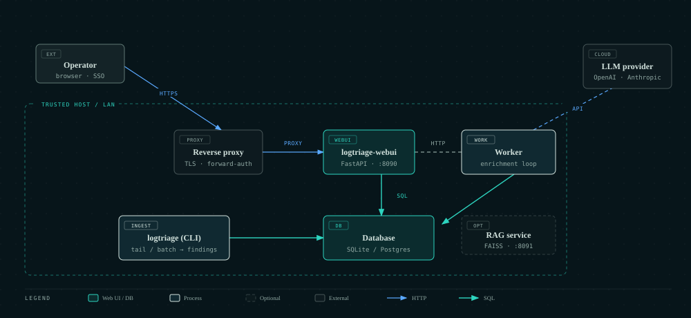
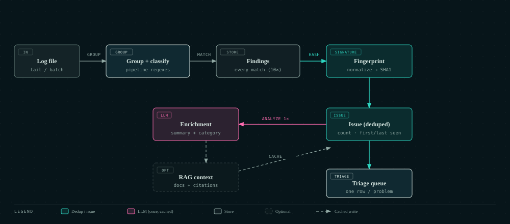
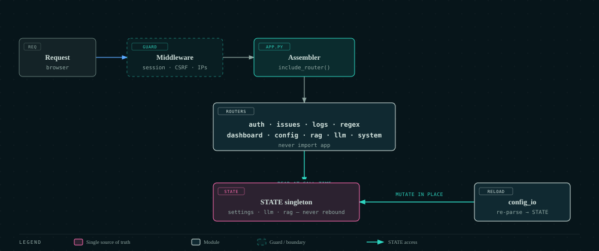

# Technical architecture (how it works)

This page describes how `log-triage` works end-to-end and what each major file/module is responsible for.

The codebase is organized around four entry points:

- `logtriage` (CLI)
- `logtriage-webui` (Web UI)
- `logtriage-rag` (RAG service)
- `logtriage-worker` (background enrichment worker)

## High-level data flow

### Batch analysis (CLI)

1. **Load config** (`logtriage/config.py`)
2. **Build pipelines/modules** (`logtriage/config.py`)
3. **Analyze a file or directory** (`logtriage/engine.py`)
4. **Group log lines** (`logtriage/grouping/*`)
5. **Classify grouped chunks** (`logtriage/classifiers/*`) to produce `Finding` objects
6. **Store findings + de-duplicate into issues** (`logtriage/webui/db.py`): `store_finding` computes a signature (`logtriage/fingerprint.py`) and upserts the matching `IssueRecord` (occurrence count, first/last seen, max severity)
7. **Enrich issues with an LLM, once per signature** (`logtriage/enrichment.py` → `logtriage/llm_client.py`), caching the summary on the issue; driven on a schedule by `logtriage/worker.py`
8. **Optionally send alerts** (`logtriage/alerts.py` / `logtriage/notifications.py`)

### De-duplication, enrichment, and live updates

- **Fingerprinting** (`logtriage/fingerprint.py`) normalizes a finding's representative line (stripping timestamps, UUIDs, IPs, numbers, …) and hashes it with the pipeline + severity into a stable signature.
- **Issues** (`IssueRecord` in `logtriage/webui/db.py`) aggregate findings sharing a signature, with occurrence counts, a first/last-seen window, severity escalation, workflow status, and a cached LLM analysis.
- **Enrichment** (`logtriage/enrichment.py`) analyzes each issue once per signature (skipping if already analyzed) and caches the result; the **worker** (`logtriage/worker.py`) runs this on an interval, in-process in the Web UI or as the standalone `logtriage-worker`.
- **Live updates** (`logtriage/webui/events.py`) push a snapshot (issue counts, latest finding id, RAG progress, worker status) to browsers over SSE at `/events`, replacing client polling. `logtriage/webui/metrics.py` serves the same state as Prometheus text at `/metrics`.

### Follow/tail analysis (CLI)

1. Follow a file like `tail -F` with rotation handling (`logtriage/stream.py`)
2. For each batch of appended lines:
   - classify
   - optionally enrich with LLM + RAG
   - optionally store/send

### Web UI

- The Web UI is a FastAPI app split into focused **routers** (`logtriage/webui/routers/`: `auth`, `issues`, `logs`, `regex`, `dashboard`, `config_editor`, `rag_api`, `llm_api`, `system`). `logtriage/webui/app.py` is a thin assembler — it builds the app, wires middleware (session, CSRF, IP-allowlist) and startup, and mounts the routers.
- All mutable runtime config lives in one **`STATE`** singleton (`logtriage/webui/state.py`) that is created once and **never rebound** — reload mutates its attributes in place (`logtriage/webui/config_io.py`). Routers read `STATE` at call time, so they always see the current config and there's no stale-after-reload binding. Cross-cutting helpers live in `logtriage/webui/shared.py`.
- It reads the same YAML configuration, surfaces the **Triage** queue (deduplicated issues with cached AI summaries, navigable by LLM **category**), a grouped/raw **Logs explorer**, an admin-only **Settings** forms editor and **Regex Lab**, DB-backed users with **role-based access**, and optional **OIDC SSO**, and can trigger LLM calls / integrate with the RAG service.

### RAG (Retrieval-Augmented Generation)

- The RAG service (`logtriage/rag/service.py`) builds and serves a documentation index.
- The CLI/Web UI optionally call the service via `logtriage/rag/service_client.py`.
- When available, the client retrieves documentation snippets relevant to a finding and appends them to the LLM prompt (`logtriage/llm_client.py`, `logtriage/llm_payload.py`).

## Key concepts

- **Pipeline**: a reusable set of grouping + classifier rules applied to matching log files.
- **Module**: binds a pipeline to an on-disk path and a runtime mode (`batch` or `follow`).
- **Finding**: a structured result representing a problem detected in logs.

## Repository structure / role of each file

### Packaging and entry points

- `setup.py`
  - Packaging metadata and extras (`webui`, `alerts`, `rag`).
  - Defines console scripts:
    - `logtriage=logtriage.cli:main`
    - `logtriage-webui=logtriage.webui.__main__:main`
    - `logtriage-rag=logtriage.rag.service:main`
    - `logtriage-worker=logtriage.worker:main`
- `logtriage/__init__.py`
  - Exposes `main` and `__version__`.
- `logtriage/__main__.py`
  - Allows `python -m logtriage` to run the CLI.
- `logtriage/cli.py`
  - CLI implementation:
    - argument parsing and command dispatch
    - module execution in batch/follow modes
    - optional config reload (`--reload-on-change`)
    - optional DB initialization and retention cleanup
    - starts a background RAG monitor to detect service readiness
- `logtriage/version.py`
  - Stores the package version string.

### Core domain model

- `logtriage/models.py`
  - Dataclasses and enums used across the application:
    - `Severity`, `Finding`
    - pipeline/module/LLM configuration models
    - RAG configuration models and retrieval result types

### Configuration loading and validation

- `logtriage/config.py`
  - Loads `config.yaml`.
  - Compiles regexes and builds:
    - `PipelineConfig` list (`build_pipelines`)
    - `ModuleConfig` list (`build_modules`)
    - LLM config (`build_llm_config`)
    - RAG config (`build_rag_config`, `build_module_rag_config`)

### Log analysis engine

- `logtriage/engine.py`
  - Batch analysis:
    - `analyze_file`: read file, group lines, classify groups
    - `analyze_path`: apply the appropriate pipeline(s) across a file or directory
- `logtriage/utils.py`
  - Utility helpers:
    - enumerate log files (`iter_log_files`)
    - pick a pipeline for a file (`select_pipeline`)

### De-duplication and enrichment

- `logtriage/fingerprint.py`
  - Normalizes a finding's representative line and computes a stable signature + 16-char fingerprint (`compute`, `normalize`, `signature_for_finding`).
- `logtriage/enrichment.py`
  - `analyze_issue`: build a payload from an issue (+ optional RAG), call the LLM once, cache the summary on the issue keyed by fingerprint; skip if already analyzed.
  - `analyze_pending_issues`: batch over issues needing analysis (used by the worker and `--analyze-issues`).
- `logtriage/worker.py`
  - `EnrichmentWorker`: interval-driven daemon thread that calls `analyze_pending_issues`; also the `logtriage-worker` standalone entry point.

### Streaming / follow mode

- `logtriage/stream.py`
  - Implements `tail -F`-like follow mode with rotation detection.
  - For each appended batch:
    - classify
    - optional LLM
    - optional persistence/alerts

### Grouping strategies (`logtriage/grouping/`)

- `logtriage/grouping/__init__.py`
  - Exposes grouping dispatch.
- `logtriage/grouping/marker.py`
  - Marker-based grouping (start/end regex delimit chunks).
- `logtriage/grouping/separator.py`
  - Separator-based grouping (split on a regex separator line; supports `only_last`).
- `logtriage/grouping/whole_file.py`
  - Whole-file grouping (treats the entire input as one chunk).

### Classifiers (`logtriage/classifiers/`)

- `logtriage/classifiers/__init__.py`
  - Exposes classifier dispatch.
- `logtriage/classifiers/regex_counter.py`
  - Regex-based classification:
    - apply ignore patterns first
    - emit a `Finding` for each match
- `logtriage/classifiers/*` (other files in the folder)
  - Additional classifier strategies (for example heuristics tailored to specific log formats).

### LLM integration

- `logtriage/llm_payload.py`
  - Renders a plain-text prompt payload for the LLM.
  - Appends RAG context when provided.
- `logtriage/llm_client.py`
  - Selects provider config and routes to the correct backend via `_call_llm()`.
  - **`openai` backend** (`_call_chat_completion`): OpenAI chat-completions format (`/v1/chat/completions`), `Authorization: Bearer` header. Covers OpenAI and any OpenAI-compatible API (Azure OpenAI, LM Studio, LiteLLM, …).
  - **`anthropic` backend** (`_call_anthropic`): Anthropic Messages API (`/v1/messages`), `x-api-key` header, `system` extracted as a top-level field with optional prompt-caching of the doc context.
  - **`ollama` backend** (`_call_ollama`): Ollama native API (`/api/chat`), no API key by default; sampling maps to Ollama `options`.
  - All backends normalize responses to the same internal shape so the rest of the pipeline is provider-agnostic. `provider_type` is read from `LLMProviderConfig` and auto-detected from `api_base` (`anthropic.com` → `anthropic`, a `:11434`/`ollama` host → `ollama`, else `openai`).
  - Handles provider auth via environment variables.
  - Optionally retrieves RAG context and adds citations.

### Alerts, notifications, and logging

- `logtriage/alerts.py`
  - Dispatches outbound alerts (webhook and/or MQTT) based on severity thresholds.
- `logtriage/notifications.py`
  - In-process notification collection used by the Web UI and RAG service endpoints.
- `logtriage/logging_setup.py`
  - Logging configuration from config.

### Web UI (`logtriage/webui/`)

- `logtriage/webui/__main__.py`
  - Web UI entry point; loads config for logging and starts uvicorn.
- `logtriage/webui/app.py`
  - Main FastAPI application:
    - routing for dashboard, log explorer, config editor, regex tools
    - session middleware setup
    - optional background RAG monitor
- `logtriage/webui/auth.py`
  - Password verification, session-token helpers, and reverse-proxy forward-auth (`resolve_proxy_user`, trusting an identity header only from `trusted_proxies`).
- `logtriage/webui/config.py`
  - Web UI-specific settings parsing (`webui.*`), including `metrics` and `forward_auth`.
- `logtriage/webui/db.py`
  - SQLAlchemy models + persistence helpers. `FindingRecord` (per occurrence, with `fingerprint`/`issue_id`) and `IssueRecord` (de-duplicated issues with counts, severity, status, and cached LLM analysis).
  - `store_finding` upserts the issue per finding; plus issue queries (`get_issues`, `issue_priority`, `get_issue_sparkline`), `backfill_issues`, retention cleanup, and statistics.
- `logtriage/webui/events.py`
  - SSE `EventHub` and live-snapshot helpers (powering `/events`).
- `logtriage/webui/metrics.py`
  - Prometheus exposition text for `/metrics`.
- `logtriage/webui/ingestion_status.py`
  - Derives module “stale/active” status for the dashboard.
- `logtriage/webui/regex_utils.py`
  - Regex validation and sample preparation helpers for the regex lab.
- `logtriage/webui/assets/*` and `logtriage/webui/templates/*`
  - Static assets and server-rendered HTML templates.

### RAG implementation (`logtriage/rag/`)

- `logtriage/rag/service.py`
  - Standalone FastAPI service:
    - initializes the index in the background
    - exposes endpoints for health, status, repository progress and retrieval
- `logtriage/rag/service_client.py`
  - HTTP client used by CLI/Web UI to talk to the RAG service.
  - Provides a `NoOpRAGClient` fallback.
- `logtriage/rag/monitor.py`
  - Background thread helper used by CLI/Web UI to monitor whether the RAG service is up and ready.
- `logtriage/rag/rag_client.py`
  - In-process coordinator (used by the RAG service):
    - knowledge management
    - document processing
    - embeddings
    - vector store
    - retrieval
- `logtriage/rag/knowledge_manager.py`
  - Clones/updates Git repositories and enumerates documentation files.
- `logtriage/rag/document_processor.py`
  - Splits documentation files into chunks (by headings/paragraphs) with memory cleanup.
- `logtriage/rag/embeddings.py`
  - Embedding generation (SentenceTransformers). **By default the model is loaded once and kept resident (in-process), encoding in batches** — fast. A subprocess-per-batch mode (full memory isolation, but reloads the model every batch and is much slower) is opt-in via `rag.embedding.use_subprocess`.
- `logtriage/rag/subprocess_embeddings.py`
  - The per-batch subprocess worker, used only when `use_subprocess` is enabled.
- `logtriage/rag/vector_store.py`
  - Persistent FAISS index + SQLite metadata store.
- `logtriage/rag/retrieval.py`
  - Builds a query from a `Finding`, embeds it, queries vector store, filters by similarity.
- `logtriage/rag/__init__.py`
  - Exposes public RAG symbols for import by the rest of the package.

## Where to look for specific behavior

- **How findings are created**: `logtriage/classifiers/*` and `logtriage/engine.py`
- **How grouping works**: `logtriage/grouping/*`
- **How follow-mode works**: `logtriage/stream.py`
- **How LLM calls happen**: `logtriage/llm_client.py`
- **How RAG is appended to prompts**: `logtriage/llm_client.py` + `logtriage/llm_payload.py`
- **How the docs index is built**: `logtriage/rag/rag_client.py` + `logtriage/rag/service.py`
